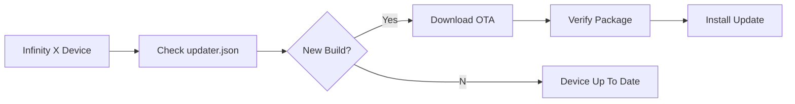

<div align="center">

# Infinity X Updater


<br>

### OTA Update Repository for Infinity X

**Unofficial Build • Infinix Hot 40 Pro (X6837)**

<br>


<br>


</div>

---

# ✨ Overview

Welcome to the **Infinity X Updater** repository.

This repository hosts the **OTA update infrastructure** used by the unofficial **Infinity X** builds for the **Infinix Hot 40 Pro (X6837)**.

It provides update metadata consumed by the built-in Infinity X Updater, allowing users to receive new releases securely and seamlessly without manually flashing every build.

Designed with reliability, simplicity and long-term maintainability in mind.

---

# 🚀 Features

✔ OTA Update Support

✔ Automatic Update Detection

✔ Secure JSON Update Metadata

✔ Lightweight Repository Structure

✔ Incremental Update Ready

✔ Community Maintained

✔ Optimized for Infinity X

✔ Android 16

---

# 📱 Device Information

| Item | Information |
|:-----|:------------|
| Device | Infinix Hot 40 Pro |
| Codename | X6837 |
| Android Version | 16 |
| ROM | Infinity X |
| Build Type | Unofficial |
| Update Method | OTA |
| Maintainer | Night Stalker |

---

# 📂 Repository Layout

```text
.
├── updater.json
├── releases/
├── changelogs/
├── assets/
└── README.md
```

---

# 🔄 OTA Flow



---

# 📦 Update Process

```text
Build Release
      │
      ▼
Generate OTA Metadata
      │
      ▼
Upload Release Files
      │
      ▼
Update updater.json
      │
      ▼
Push to GitHub
      │
      ▼
Infinity X Devices Receive OTA
```

---

# 🌌 About Infinity X

Infinity X is a modern Android aftermarket firmware focused on delivering

- Performance
- Stability
- Smooth UI
- Clean Design
- Pixel Experience
- Reliable OTA Updates

while preserving a lightweight and refined user experience.

---

# 👤 Maintainer

<div align="center">

## Night Stalker

### Unofficial Infinity X Maintainer

Android Device Tree • Kernel • Vendor • OTA Infrastructure

</div>

---

# ⚠ Disclaimer

This repository is maintained independently by the community.

It is **not affiliated with, endorsed by, or officially maintained by the Infinity X Project.**

All OTA packages distributed through this repository are intended **only** for the unofficial Infinity X builds targeting the **Infinix Hot 40 Pro (X6837).**

---

# ❤️ Credits

- Infinity X Team
- Android Open Source Project
- All Contributors
- Open Source Community

---

<div align="center">

## ⭐ Enjoying Infinity X?

Give this repository a ⭐ if you appreciate the project.

---

### Made with ❤️ for the Android Community

### Unofficially maintained by **Night Stalker**

</div>
